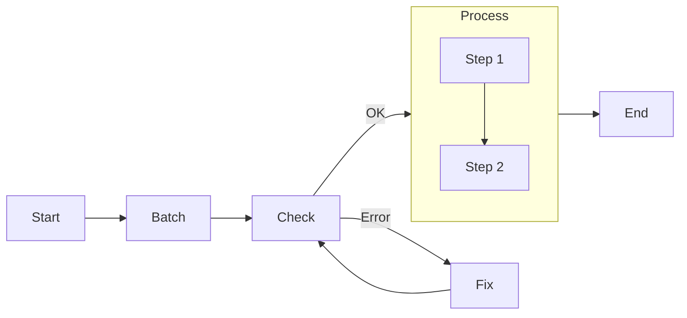

# PocketFlow TypeScript Guide

## Agentic Coding: Humans Design, Agents Code!

> If you are an AI agent or developer building LLM systems with PocketFlow (TypeScript edition), read this guide **very carefully**! This is the most important chapter for collaborative, agentic system design. Always:
> 1. Start with a small, simple solution.
> 2. Design at a high level before implementation.
> 3. Frequently ask for human feedback and clarification.

---

## Agentic Coding Steps

| Step             | Human      | AI/Agent   | Comment                                                                 |
|------------------|------------|------------|-------------------------------------------------------------------------|
| 1. Requirements  | ★★★ High   | ★☆☆ Low    | Humans clarify requirements and context.                                |
| 2. Flow Design   | ★★☆ Medium | ★★☆ Medium | Humans specify high-level design, AI fills in details.                  |
| 3. Utilities     | ★★☆ Medium | ★★☆ Medium | Humans provide APIs/integrations, AI helps with implementation.         |
| 4. Node Design   | ★☆☆ Low    | ★★★ High   | AI helps design node types and data handling.                           |
| 5. Implementation| ★☆☆ Low    | ★★★ High   | AI implements the flow based on the design.                             |
| 6. Optimization  | ★★☆ Medium | ★★☆ Medium | Humans evaluate, AI helps optimize.                                     |
| 7. Reliability   | ★☆☆ Low    | ★★★ High   | AI writes test cases and addresses corner cases.                        |

### 1. Requirements
- Clarify the user-centric problem and context.
- Evaluate if an AI/agentic system is a good fit.
- Focus on high-value, low-complexity features first.

### 2. Flow Design
- Outline the orchestration of nodes at a high level.
- Identify design patterns (e.g., MapReduce, Agent, RAG, Batch, Parallel).
- For each node, write a one-line description of its purpose.
- Draw the flow using a diagram (e.g., Mermaid):



> **Tip:** If humans can't specify the flow, agents can't automate it! Work through example inputs manually to develop intuition.

### 3. Utilities
- Identify and implement utility functions (e.g., LLM calls, web search, file I/O).
- Each utility should be a TypeScript function or class, tested independently.
- Document input/output types and necessity.

**Example:**
```ts
// utils/getEmbedding.ts
export async function getEmbedding(text: string): Promise<number[]> {
  // Call embedding API...
  return [/* ...vector... */];
}
```

### 4. Node Design
- Use a shared state object (plain TypeScript object or class) for all node data.
- For each node, specify:
  - **Type:** Regular, Batch, Async, Parallel
  - **prep:** What data to read from shared state
  - **exec:** What core logic or utility to call
  - **post:** What to write back to shared state

**Example:**
```ts
class GetQuestionNode extends BaseNodeImpl<Shared, Params, Action> {
  exec(): Action {
    // Read from input, return action
    return 'next';
  }
  post(shared, prepRes, execRes) {
    shared.question = execRes;
    return 'next';
  }
}
```

### 5. Implementation
- Implement nodes and flows in TypeScript, using the abstractions in `node.ts` and `flow.ts`.
- Keep it simple; avoid overengineering.
- Use logging for debugging, but silence logs in tests.

### 6. Optimization
- Use human intuition for initial evaluation.
- Redesign flows or nodes as needed for clarity and modularity.
- Optimize prompts, utility calls, and error handling.

### 7. Reliability
- Add retries and error handling in nodes as needed.
- Write comprehensive tests using Vitest (see `__tests__` directory).
- Visualize or log node transitions for easier debugging.

---

## Example TypeScript Project Structure

```
my_project/
├── src/
│   └── core/
│       └── pocketflow/
│           ├── node.ts
│           ├── flow.ts
│           ├── types.ts
│           ├── utils/
│           │   └── getEmbedding.ts
│           ├── __tests__/
│           │   ├── test_node.ts
│           │   └── test_flow.ts
│           └── guide.md
├── package.json
├── tsconfig.json
└── README.md
```

- **`guide.md`**: This file. High-level, no-code design and best practices.
- **`utils/`**: All utility functions (one file per API or integration).
- **`node.ts`**: All node definitions and base classes.
- **`flow.ts`**: Flow orchestration and builder logic.
- **`__tests__/`**: Vitest test suites for nodes and flows.

---

## References
- [PocketFlow Official Guide](https://the-pocket.github.io/PocketFlow/guide.html)
- [PocketFlow GitHub](https://github.com/the-pocket/PocketFlow)
- [PocketFlow Logger Documentation](./logger.md)

---

## Logging and Error Handling

PocketFlow includes a robust logging system that provides both user-friendly console output and detailed logs for debugging. The logger is designed to:

- Provide clear, actionable error messages to users
- Maintain detailed logs for debugging and troubleshooting
- Support different log levels (debug, info, warn, error)
- Integrate with workspace management for log persistence

For detailed information about the logging system, including implementation details and best practices, see the [Logger Documentation](./logger.md).

---

**Agentic Coding = Human Design + Agent Implementation!**

> Start simple, iterate fast, and always keep the user's needs at the center of your design. 